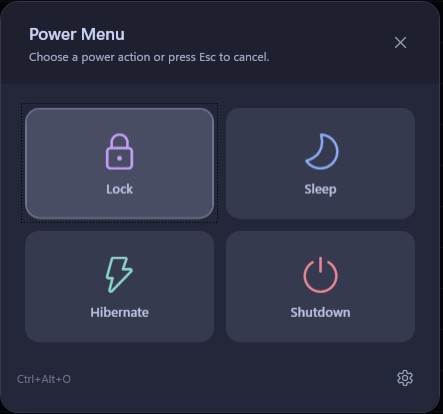

# PowerMenu

A lightweight, Catppuccin-themed power menu for Windows. Press a global hotkey to instantly lock, sleep, hibernate, or shut down — then get out of the way.

---

## Screenshot



---

## Features

- **Global hotkey** — fully configurable modifier + key combination (default `Ctrl+Alt+P`)
- **Four power actions** — Lock, Sleep, Hibernate, Shutdown (with cancel)
- **Lock + screensaver** — activates the screensaver and locks simultaneously
- **Four Catppuccin flavors** — Mocha, Macchiato, Frappé, Latte with live preview
- **System tray** — runs silently in the background, zero taskbar presence
- **Start with Windows** — optional auto-start via registry
- **MSIX packaging** — side-loadable installer with self-signed certificate
- **Self-contained** — single executable, no runtime installation required

---

## Requirements

- Windows 10 1809 (build 17763) or later
- x64 processor
- [Windows 10/11 SDK](https://developer.microsoft.com/windows/downloads/windows-sdk/) — only needed to build the MSIX

---

## Installation

### Option A — MSIX (recommended)

1. Build the package (see [Building from source](#building-from-source)).
2. On first build, run once in an **elevated** PowerShell to trust the self-signed certificate:
   ```powershell
   .\Build.ps1 -InstallCert
   ```
3. Double-click `dist\PowerMenu.msix` and click **Install**.

### Option B — Standalone executable

Publish directly and run the executable — no installer needed:

```powershell
dotnet publish PowerMenu.csproj `
    --configuration Release `
    --runtime win-x64 `
    --self-contained true `
    --output dist\publish `
    /p:PublishSingleFile=true
```

Then run `dist\publish\PowerMenu.exe`.

---

## Building from source

### Prerequisites

- [.NET 8 SDK](https://dotnet.microsoft.com/download/dotnet/8.0)
- Windows 10/11 SDK (for `MakeAppx.exe` and `SignTool.exe`)

### Build

```powershell
.\Build.ps1
```

The script:

1. Publishes a self-contained `win-x64` single-file executable to `dist\publish\`
2. Generates placeholder MSIX tile and logo assets under `Package\Assets\`
3. Assembles the MSIX layout in `dist\msix-layout\`
4. Creates a self-signed code-signing certificate at `dist\PowerMenu.pfx` (reused on subsequent builds)
5. Packs the MSIX with `MakeAppx.exe`
6. Signs it with `SignTool.exe`

| Flag | Effect |
|------|--------|
| *(none)* | Build and sign the MSIX |
| `-InstallCert` | Also import the certificate into `LocalMachine\Root` and `LocalMachine\TrustedPeople` so the package can be installed without Developer Mode (requires elevation) |
| `-SdkVersion <ver>` | Pin a specific Windows SDK version instead of auto-detecting the latest |

Output: `dist\PowerMenu.msix`

---

## Usage

### Opening the menu

Press the configured hotkey (default **`Ctrl+Alt+P`**) from anywhere. The menu appears centered on screen over a semi-transparent overlay. Press the hotkey again or click outside the card to dismiss.

### Power actions

| Button | Action |
|--------|--------|
| **Lock** | Activates the screensaver and locks the workstation |
| **Sleep** | Suspends to RAM (S3) |
| **Hibernate** | Suspends to disk (S4) |
| **Shutdown** | Initiates a 5-second countdown shutdown |

A shutdown countdown can be aborted from the tray icon's context menu before it expires.

### System tray

The tray icon sits in the notification area. Right-clicking it reveals:

- **Open Menu** — same as pressing the hotkey
- **Settings** — opens the settings window
- **Exit** — quits the application

Double-clicking the tray icon also opens the menu.

---

## Configuration

Open Settings via the gear icon in the menu footer or the tray context menu.

### Keyboard shortcut

Choose any combination of **Ctrl**, **Alt**, **Shift**, and **Win** as modifiers, then select a key from the dropdown (A–Z, 0–9, F1–F12). The current shortcut is shown as a live preview.

### Theme

Click any of the four theme buttons to preview it immediately. The four swatches on each button show a sample of that flavor's accent colors. The preview is live — cancel to revert.

| Flavor | Base color | Character |
|--------|-----------|-----------|
| **Mocha** | `#1e1e2e` | Darkest, cool-toned — default |
| **Macchiato** | `#24273a` | Slightly lighter, muted accents |
| **Frappé** | `#303446` | Warm dark, medium contrast |
| **Latte** | `#eff1f5` | Light mode, dark text |

### Start with Windows

Checking this box adds PowerMenu to `HKEY_CURRENT_USER\SOFTWARE\Microsoft\Windows\CurrentVersion\Run`. Unchecking removes it. No elevation required.

---

## Settings file

Settings persist to `%APPDATA%\PowerMenu\settings.json`:

```json
{
  "theme": "Mocha",
  "hotkeyModifiers": 3,
  "hotkeyVirtualKey": 80,
  "startWithWindows": false
}
```

| Field | Type | Description |
|-------|------|-------------|
| `theme` | string | Active Catppuccin flavor name |
| `hotkeyModifiers` | uint | Win32 modifier bitmask — Ctrl `0x02`, Alt `0x01`, Shift `0x04`, Win `0x08` |
| `hotkeyVirtualKey` | int | Win32 virtual-key code (`0x50` = P) |
| `startWithWindows` | bool | Whether the registry run key is set |

---

## Architecture

```
PowerMenu/
├── App.xaml / App.xaml.cs          Entry point, tray icon, hotkey wiring
├── Models/
│   ├── AppSettings.cs              Settings data model + hotkey display helpers
│   └── CatppuccinPalette.cs        All four flavor color definitions
├── Services/
│   ├── HotkeyService.cs            Win32 RegisterHotKey / WM_HOTKEY message pump
│   ├── PowerService.cs             Lock, Sleep, Hibernate, Shutdown via P/Invoke
│   ├── SettingsService.cs          JSON read/write to %APPDATA%\PowerMenu
│   └── ThemeService.cs             Runtime ResourceDictionary swapping
├── Windows/
│   ├── PopupWindow.xaml(.cs)       Full-screen overlay with 2×2 action grid
│   └── SettingsWindow.xaml(.cs)    Hotkey, theme, and startup configuration
└── Resources/Themes/
    ├── Mocha.xaml
    ├── Macchiato.xaml
    ├── Frappe.xaml
    └── Latte.xaml
```

### Key implementation notes

- **Hidden window** — a 0×0 invisible window is created at startup solely to own the `RegisterHotKey` handle and receive `WM_HOTKEY` messages via `HwndSource`.
- **`ShutdownMode="OnExplicitShutdown"`** — prevents WPF from exiting when windows close; the process stays alive in the tray until the user selects Exit.
- **Theme switching** — themes are WPF `ResourceDictionary` files loaded at runtime. All color bindings use `DynamicResource`, so swapping the dictionary updates every visible element instantly.
- **Lock implementation** — sends `WM_SYSCOMMAND / SC_SCREENSAVE` to the desktop window before calling `LockWorkStation()`, ensuring the screensaver activates alongside the lock.
- **Startup toggle** — writes directly to the `HKCU` run key; no UAC prompt required.

### Win32 dependencies

| DLL | Functions used |
|-----|----------------|
| `user32.dll` | `RegisterHotKey`, `UnregisterHotKey`, `LockWorkStation`, `GetDesktopWindow`, `SendMessage` |
| `Powrprof.dll` | `SetSuspendState` |

---

## Project file highlights

```xml
<TargetFramework>net8.0-windows</TargetFramework>
<OutputType>WinExe</OutputType>
<UseWPF>true</UseWPF>
<UseWindowsForms>true</UseWindowsForms>   <!-- NotifyIcon -->
<PublishSingleFile>true</PublishSingleFile>
<SelfContained>true</SelfContained>
<RuntimeIdentifier>win-x64</RuntimeIdentifier>
<WindowsPackageType>None</WindowsPackageType>  <!-- manual MSIX via Build.ps1 -->
```

The only NuGet dependency beyond the Windows SDK is `System.Text.Json` (8.0.5) for settings serialization.
